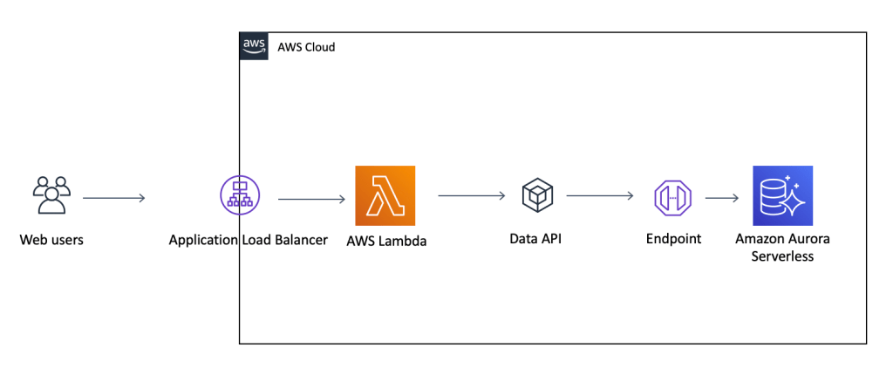

#Reference

- [AWS Data API for Amazon Aurora Serverless][goranopacic]

# Deploy Setps

1. Deploy Vpc Stack
2. Deploy Rds Stack
3. Deploy Lambda Stack
4. Deploy Alb Stack

# Welcome to your CDK TypeScript project!

This is a blank project for TypeScript development with CDK.

The `cdk.json` file tells the CDK Toolkit how to execute your app.

## Useful commands

- `npm run build` compile typescript to js
- `npm run watch` watch for changes and compile
- `npm run test` perform the jest unit tests
- `cdk deploy` deploy this stack to your default AWS account/region
- `cdk diff` compare deployed stack with current state
- `cdk synth` emits the synthesized CloudFormation template

<!-- Reference -->

[goranopacic]: https://madabout.cloud/2019/09/01/aws-data-api-for-amazon-aurora-serverless/
